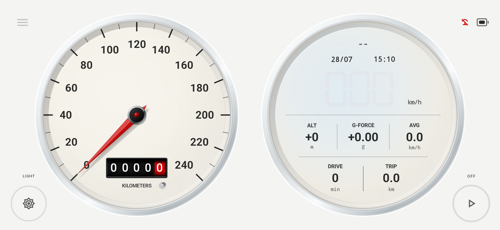
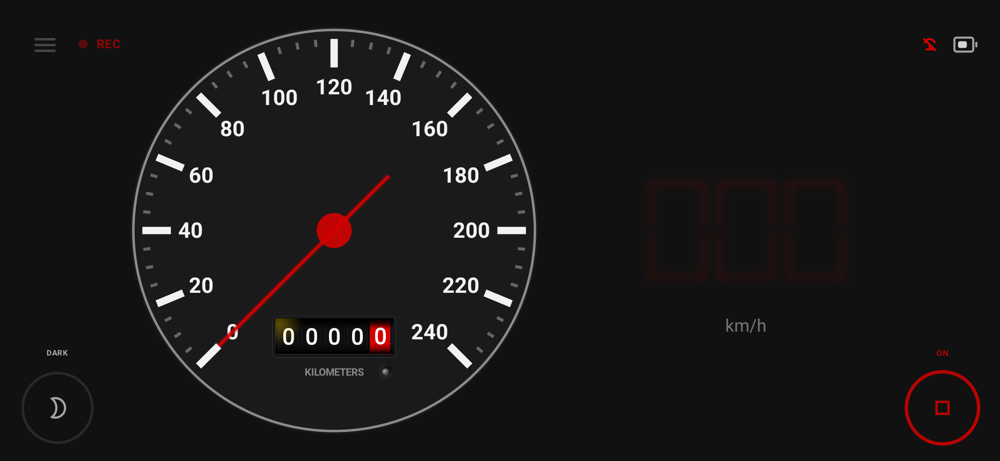
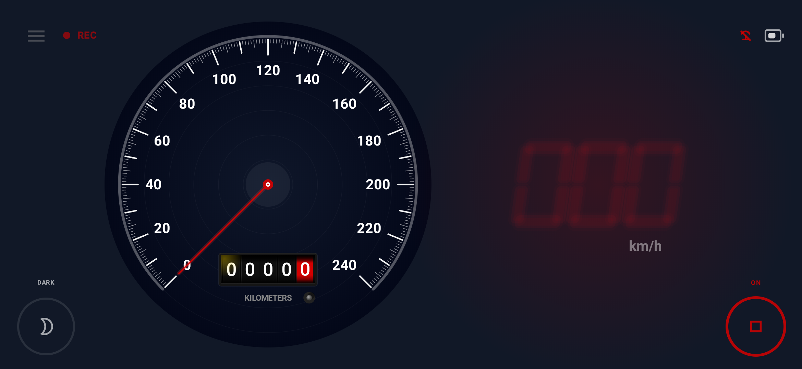
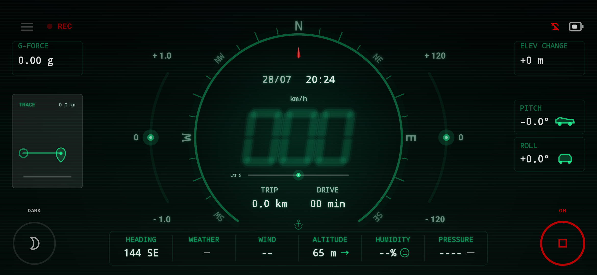

# NEOGAUGE

### A retro-futuristic Android driving companion

Four expressive dashboards ? Clear GPS speed ? Local journey memories

[Official website](https://jianli03.github.io/NeoGauge/) ?
[Download for Android](https://jianli03.github.io/NeoGauge/download/) ?
[????](#??)

## Make every drive feel different

NeoGauge turns live driving data into a clear, expressive digital dashboard.
It combines four distinctive visual themes with glanceable GPS speed and quiet
journey memories that stay on your device.

It is designed as a warm, distraction-free driving companion?not another
analytics platform, social feed, or advertising surface.

## Four dashboards

| Classic | Heritage |
| --- | --- |
|  |  |
| Mechanical calm, ceramic-style bezels, and timeless instrument character. | Warm analog personality and familiar colors for nostalgic everyday drives. |

| Colorful | Neon |
| --- | --- |
|  |  |
| Bright, approachable, and playful for relaxed daily driving. | Deep blacks and luminous digital segments for focused night drives. |

Each theme has its own visual language while preserving the same priorities:
clear speed, balanced layout, and minimal distraction.

## Designed for the road

- **Large, readable speed** ? visibility always takes priority over decoration.
- **Responsive GPS display** ? tuned for smooth motion and fast deceleration response.
- **Day and night palettes** ? suitable contrast for changing light conditions.
- **Portrait and landscape layouts** ? designed for different mounts and screens.
- **Phone and tablet support** ? adaptive spacing keeps the dashboard balanced.
- **Real-road refinement** ? tested and improved through everyday driving.

## Journey memories

NeoGauge can keep lightweight journey records such as distance, duration, and
driving pace. The goal is to remember where the day took you without turning
every drive into a score, social post, or cloud profile.

Journey records stay on your device.

## Privacy by design

NeoGauge uses location on your device to calculate GPS speed and support journey
records.

- No advertising
- No analytics SDKs
- No user tracking
- No location-history uploads
- No personal data collection

Read the [Privacy Policy](privacy.html) for details.

## Download

Download the latest stable Android release from the permanent download page:

### [Download NeoGauge for Android](https://jianli03.github.io/NeoGauge/download/)

Android 10 or newer is recommended. Location permission is required for live
GPS speed.

> NeoGauge is a supplemental display. Mount your device securely, do not
> operate it while driving, and always follow local traffic laws.

## Project

This repository contains the NeoGauge public website, download redirect, release
metadata, privacy policy, and disclaimer.

- **App:** Kotlin and Jetpack Compose
- **Website:** Static HTML hosted with GitHub Pages
- **Feedback:** [GitHub Issues](https://github.com/Jianli03/NeoGauge/issues)
- **License:** [MIT](LICENSE)

Developed with love by James Li in Melbourne, Australia.

---

# ??

## ??????????????

NeoGauge ????????? Android ??????????????????????
?????????????????????????????????

??????????????????????????????????????

## ??????

| Classic ?? | Heritage ?? |
| --- | --- |
|  |  |
| ???????????????????????? | ???????????????????????? |

| Colorful ?? | Neon ?? |
| --- | --- |
|  |  |
| ?????????????????????? | ????????????????????????? |

???????????????????????????????????????

## ????????

- **???????**???????????????
- **?????? GPS ??**????????????????
- **????**??????????????
- **?????**??????????????
- **???????**??????????????????
- **??????**????????????????

## Journey ????

NeoGauge ????????????????????????????????????
???????????????????????????

??????????????

## ????

NeoGauge ?????????????? GPS ????? Journey ???

- ????
- ???? SDK
- ??????
- ???????
- ???????

???????[????](privacy.html)?

## ??

???????????? Android ????

### [?? NeoGauge Android ???](https://jianli03.github.io/NeoGauge/download/)

???? Android 10 ???????? GPS ?????????

> NeoGauge ??????????????????????????????????????

## ????

????? NeoGauge ?????????????????????????

- **App?** Kotlin ? Jetpack Compose
- **???** GitHub Pages ????? HTML
- **???** [GitHub Issues](https://github.com/Jianli03/NeoGauge/issues)
- **????** [MIT](LICENSE)

? James Li ?????????????
